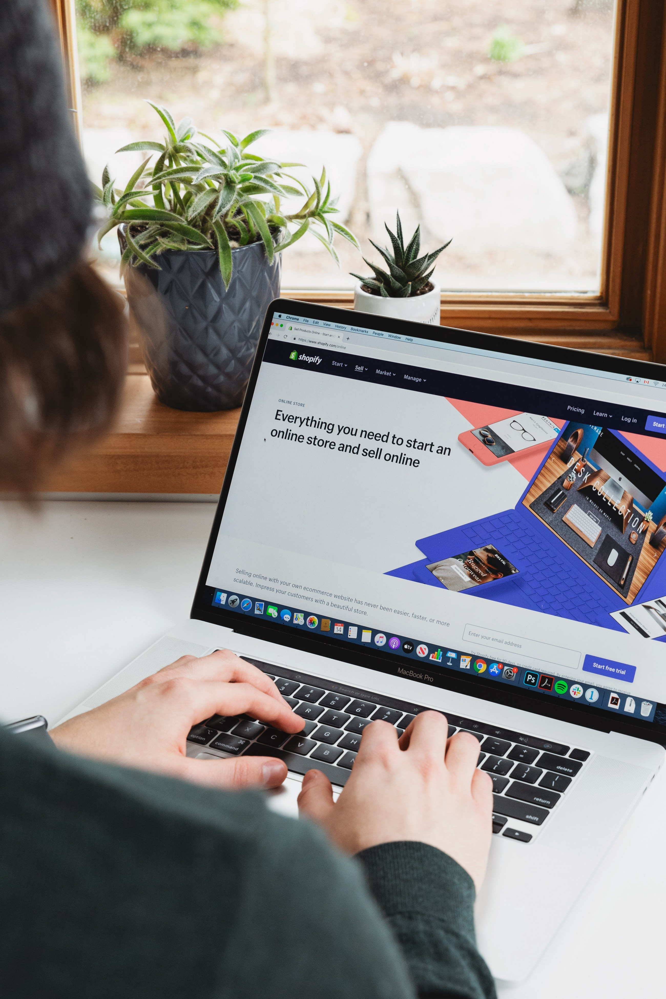

Recently I created this amazing, super-fast, mobile-first, super-responsive website for a demo Shopify store with Gatsby and I was amazed by its performance. It took me some time to get it right but the process was not that tough and once I completed it I thought I would document it so others can benefit.

### What is Headless CMS?

Headless, in the context of eCommerce, essentially describes the principle of separating the front-end of your store from the eCommerce platform, with a view to driving improvements around flexibility, performance, or operations, generally. A headless [eCommerce](http://GoBeyond.ai) site would use a different front-end framework (such as a custom react framework or something like VueStorefront for example) or CMS (e.g. Contentful or Prismic) and would then pull in content and components via APIs. Shopify supports this approach via the storefront API. — [**Paul Rogers**](https://paulnrogers.com/headless-shopify/)

### Why I should use Gatsby as a front end for my Shopify Store

**Pros/benefits of using Gatsby and Shopify**

*   Mobile-first and super-fast e-commerce website
*   Gets you more organic traffic because of Google rewards high-performance website
*   Increase your conversion rate by reducing loading time
*   More flexible in terms of design and format — not restricted by working to the strengths and features of Shopify Liquid Language

**Cons / Disadvantages of using Gatsby and Shopify**

*   You need to host your front end in a separate host (You can use [netlify](https://www.netlify.com/pricing/) with 100GB bandwidth/month )
*   Need to maintain two technologies/platforms
*   Loss of lots of apps that don’t have APIs available to work with the Storefront API

### How I build a Shopify store with Gatsby JS?

The requirement for this tutorial

*   a Shopify Store
*   Basic knowledge of how to build Gatsby website

Demo Store: [https://ilias-shopify-gatsby.netlify.app/](https://ilias-shopify-gatsby.netlify.app/)

### **Setup new Gatsby Website**

```javascript

 gatsby new shopify-store [https://github.com/IliasHad/gatsby-shopify-starter](https://github.com/IliasHad/gatsby-shopify-starter)

```

### Get API access token to your Shopify shop


Click on Manage Private Apps

Click on manage private apps > Create a new private app


Allow Gatbsy to read your Shopify store data

After the private app is created, you will get an API key to access your Shopify store data

```javascript

 SHOP_NAME=YOUR SHOPIFY STORE NAME
 SHOPIFY_ACCESS_TOKEN=YOUR API KEY

```


You need to change the environment variable in .env.development file (if you want to just test a demo) and in .env.production with production store API key and name

SHOP\_NAME is your Shopify store name. for example, my Shopify store is ilias-gatsby.myshopify.com. the Shopify store name is ilias-gatsby

SHOPIFY\_ACCESS\_TOKEN is the API key you got when you created the private application

Finally, you need to run gatsby develop to run the website

```javascript

  gatsby develop

```

Voila, you have a Gatsby website powered by your Shopify store data

#### References:

*   [Gatsby Source Shopify Plugin](https://www.gatsbyjs.org/packages/gatsby-source-shopify/)
*   [Gatsby Shopify Starter](https://github.com/AlexanderProd/gatsby-shopify-starter)
*   [Headless Shopify Introduction](https://paulnrogers.com/headless-shopify/)
*   [Optimizing Ecommerce websites with Gatsby](https://www.youtube.com/watch?v=ZEIyRI2-Fa0)