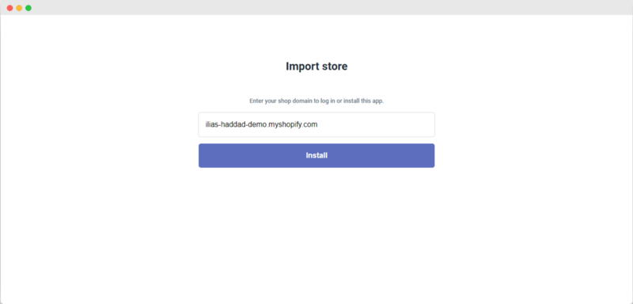
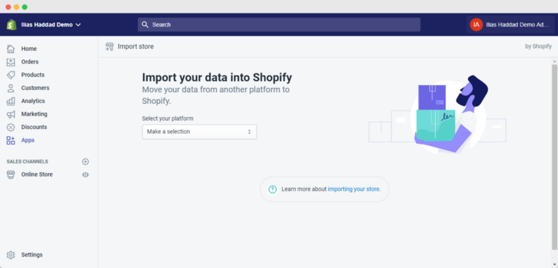
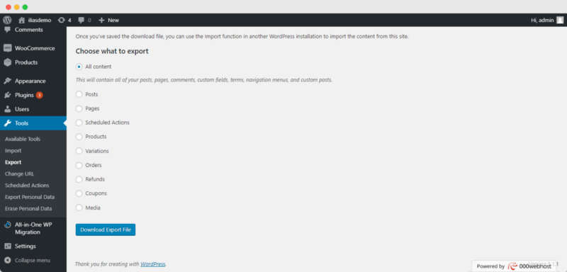
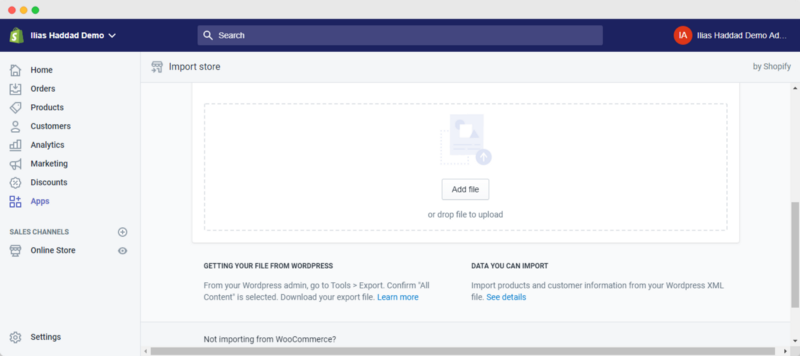
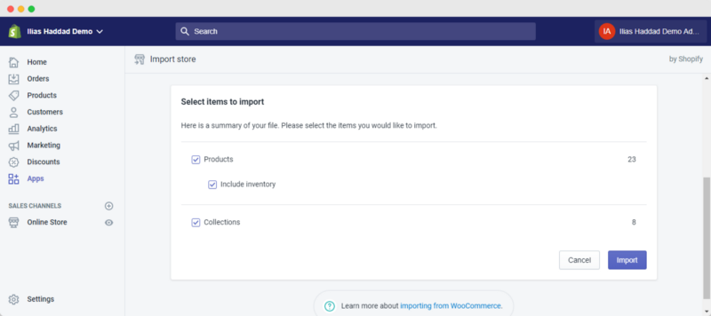
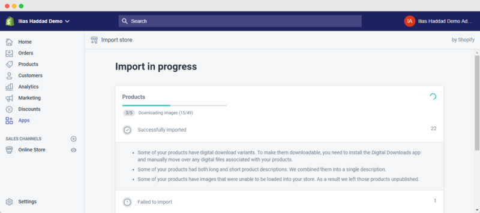
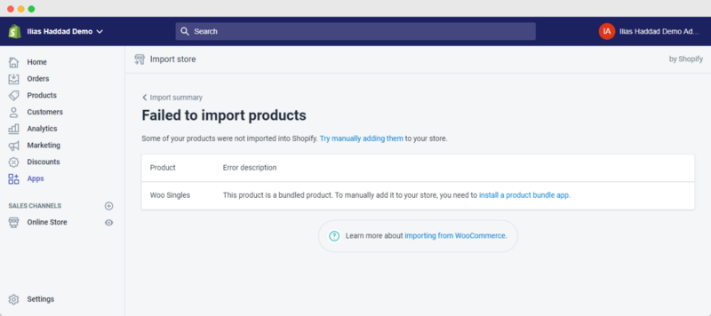

Yesterday, I watch the webinar from Shopify Partners which explains how you can migrate your Woo-commerce Store Data to Shopify easy and with Shopify Official App and I’m very surprised that Shopify has their own Woocommerce Migration App but not listed in Shopify App Marketplace

# **Let’s Start it!**

### Step 1: Install the Shopify Migration Tool

Visit [this link](http://import-store.shopifyapps.com) and paste your Shopify Store Link

Shopify Migration Tool Installation

and after that, you need to give the tool permissions to import products

Shopify Migration Tool Permission

### Step 2: Choose Woocommerce as a platform

Select Woocommerce from Drop-down Menu

### Step 3: Export Your WooCommerce Store Data

Go to **Wordpress Admin Dashboard > Tools > Export** and Select All Content and click on download export file

Export Your WooCommerce Store Data

### Step 4: Import Exported Data to Shopify Migration Tool

Click on Add file and select XML Exported file and it’s will start extracting data founded in the XML file

After extracting data and it’s will show the number of products and collection founded in XML file and you deselect “Include Inventory” if you don’t want to import products inventory and after that click on import button

You can leave the App import data and maybe will take a few hours to import it depends on the number of products and variations and once the importation is complete you’ll receive an email and you’ll have some failed importations

### References

* Migrating Clients from WooCommerce to Shopify: Why and How to Make the Move — [Youtube](https://www.youtube.com/watch?v=zv3HgyaZ0-4)

Have a nice day!

Ilias

My Social Links:

* [Twitter](https://twitter.com/IliasHaddad3)

* [Linkedin](https://www.linkedin.com/in/ilias-haddad/)