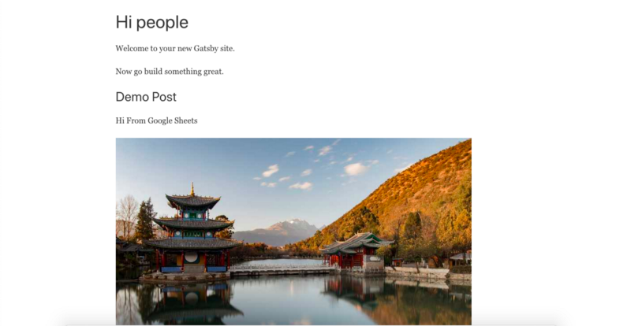

 on [Unsplash](https://unsplash.com/s/photos/developer?utm_source=unsplash&utm_medium=referral&utm_content=creditCopyText)](../../images/1__M8Y__frxOMNG9MLxV7z5Lvw.jpeg)
Photo by [Arian Darvishi](https://unsplash.com/@arianismmm?utm_source=unsplash&utm_medium=referral&utm_content=creditCopyText) on [Unsplash](https://unsplash.com/s/photos/developer?utm_source=unsplash&utm_medium=referral&utm_content=creditCopyText)

Recently I created a Gatsby website that uses Google sheets as Database and. It took me some time to get it right but the process was not that tough and once I completed it I thought I would share how to build similar one with basic functionality

### What we will be doing today?

*   Setup new Gatsby Project
*   Install and Config Gatsby Google Sheets Source Plugin
*   Fetch remote images and make them ready to use in Gatbsy Image
*   Query and Display the data from Google Sheets

### **Setup New Gatsby Project**

*   Ensure you have the latest **LTS** version of Node installed (>= 10.16.0). `node --version`
*   [Install](https://yarnpkg.com/en/docs/install) the Yarn package manager.
*   Ensure you have the latest version of Yarn installed (>= 1.0.2). `yarn --version`

First, install gatsby-cli globally

yarn global add gatsby-cli

Second, Create a new Gatsby website

gatsby new gatsby-google-sheets-starter 

Finally, run the Gatsby website

cd gatsby-google-sheets-starte && yarn develop

### **Install and Config Gatsby Google Sheets Source Plugin**

First, you need to get Google Sheets API credentials to be able to read data from sheets

1.  Go to the [Google APIs Console](https://console.developers.google.com/).
2.  Create a new project.
3.  Click `Enable API`. Search for and enable the Google Drive API.
4.  `Create credentials` for a `Web Server` to access `Application Data`.
5.  Name the service account and grant it a `Project` Role of `Editor`.
6.  Download the JSON file.
7.  Copy the JSON file to your code directory and rename it to `secret.json`

Second, you need to install the gatsby source google sheets

yarn add gatsby-source-google-sheets

Third, add the plugin in gatsby-config.js

spreadsheetId= the id is after the [https://docs.google.com/spreadsheets/d/](https://docs.google.com/spreadsheets/d/)YOUR ID/edit#gid=0

### Fetch remote images and make them ready to use in Gatbsy Image

Note: I’ll use this G[oogle Sheet](https://docs.google.com/spreadsheets/d/1L0aW6utYrcfd7xwYp1cIUkv8As4cFx1ECb0phF9-CEE/edit#gid=0) as a demo

First, install gatsby-source-filesystem

yarn add gatsby-source-filesystem

Second, add this code to gatsby-node.js

Finally, replace node.featuredimage with the field where you have remote image URL

### Query and Display the data from Google Sheets

First, change pages/index.js file

Second, run the gatsby website

gatsby develop

Voila, You have a Gatsby website powered by Google Sheets

Gatsby Website Powered By Google Sheets