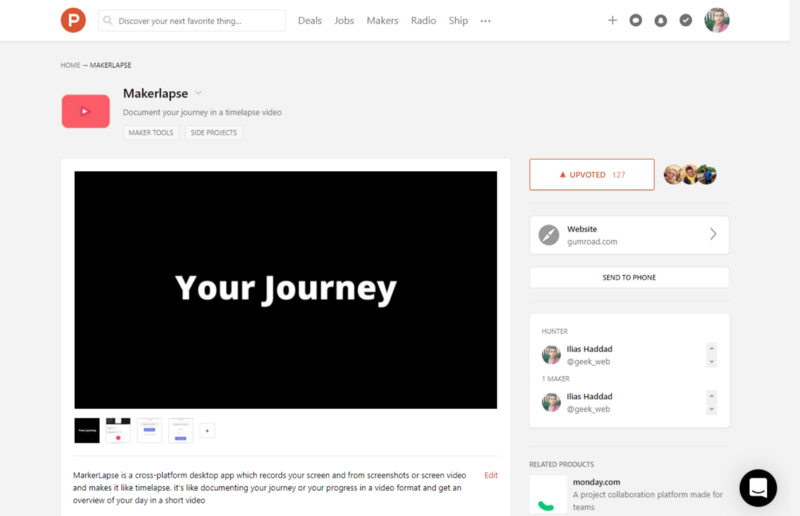
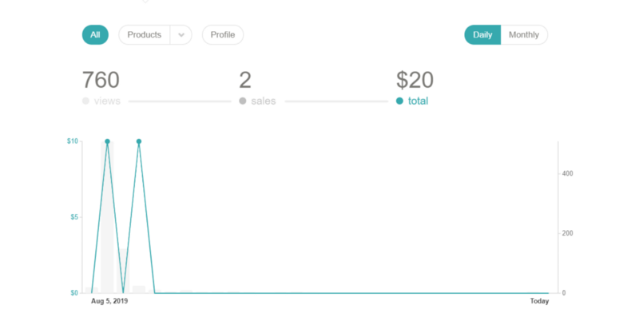
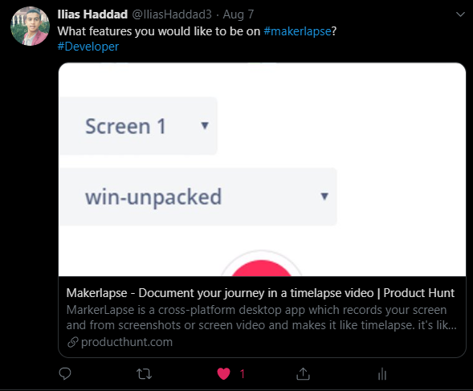
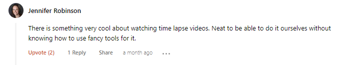
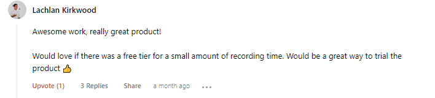
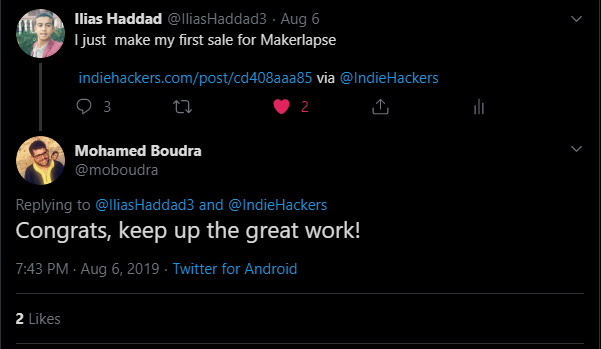
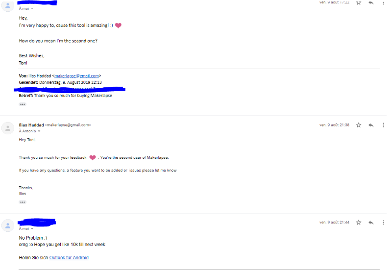

 On [Unsplach](https://unsplash.com/photos/Agx5_TLsIf4/)](../../images/1__73oXq1pNNQoEUd9pOq4jXA.jpeg)
Photo by [Fatos Bytyqi](https://unsplash.com/@fatosi) On [Unsplach](https://unsplash.com/photos/Agx5_TLsIf4/)

After launching the beta version of Habitscript and getting great feedback about the idea and I’m still working on launching the v1 soon this month.

### Finding The Idea

While building habitscript, I watched a [video](https://www.youtube.com/watch?v=0ZeO0IQaJ-A&t=320s) from Devon Crawford about automating his process of video editing using FFmpeg and I already watch a lot of speed coding videos ,also a [video](https://www.youtube.com/watch?v=FN144KdOIGM) about the journey of Pieter Levels while building Hoodmaps and a [video](https://www.youtube.com/watch?v=OtsNNXpXcYs) about the journey of [Guilherme Rizzo](https://medium.com/u/2be928152fca) while building CSS Scan and I got excited about documenting my journey in a timelapse video

### Building The Product

Indie hackers members recommend using what I already when I built Habitscript and it’s will save a lot of time. You need to use tools and programming language you already knew and familiar it.

I already have some experience in Node js, so I decided to use an electron which I can build a cross-platform (Windows, Mac, Linux desktop app with same code) desktop app.

After about 5 days I built makerlapse and its’ run correclty like I want to be

### What I learned after building makerlapse

*   **Build an electron app**: I watched some tutorials videos on youtube and I read some medium articles about building an electron app
*   **Build something simple and useful:** Don’t spend a lot of times building a feature that isn’t necessary
*   **Build a landing page before launching on ProductHunt.** When I launched habitscript and makerlapse I didn’t spend time on building a landing page and I lose a lot of visitors (potential paying customers) from producthunt

### **After Launching Makerlapse on ProductHunt :**

*   **I got 127 upvotes on ProductHunt and it’s amazing**

Makerlapse ProduHunt Page

*   **I make two sales after launching and I’m very happy about it**

Makerlapse Stats On Gumroad

### Mistakes I make while lancing on ProductHunt

*   I don’t spend time on building a landing page and newsletter and I lose a lot of potential paying customers and redirect all visitors to gumroad product page
*   I don’t spend time on designing a featured image ( The first image on product hunt media gallery and image used when your share producthunt link on social media

### Feedback About Makerlapse:

Thank you so much for anyone who upvotes makerlapse on [ProductHunt](https://www.producthunt.com/posts/makerlapse) and leaves his feedback about it :)

Feedback About Makerlapse
Feedback About Makerlapse
Feedback About Makerlapse

Feedback from the second paying user of makerlapse

*   My Favorite Links:
*   [IndieHackers](https://www.indiehackers.com/)
*   [ProductHunt](https://www.producthunt.com/)
*   [r/sideproject](https://www.reddit.com/r/sideproject)
*   [FreeCodeCamp](https://www.freecodecamp.org/news/)
*   [Marketing](https://marketingexamples.com/) Examples
*   [NoCsDegree](https://www.nocsdegree.com/)
*   [Makerlapse](https://makerlapse.netlify.com)

If you enjoyed my story please consider clapping 👏

If you want to know what I’m currently working on, you can follow my #12SideProjectsIn3Months [on Twitter](https://twitter.com/iliashaddad3)

Be sure to send a message [on Twitter](https://twitter.com/iliashaddad3) with any questions you have, I’m always happy to help