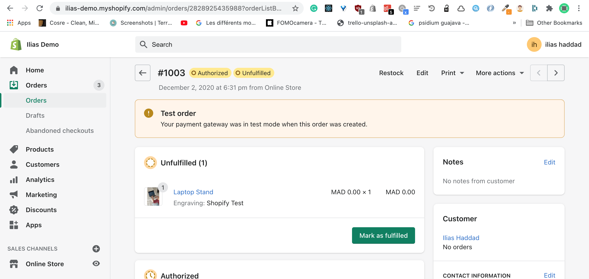
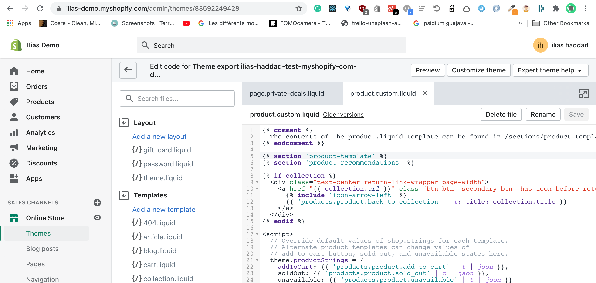
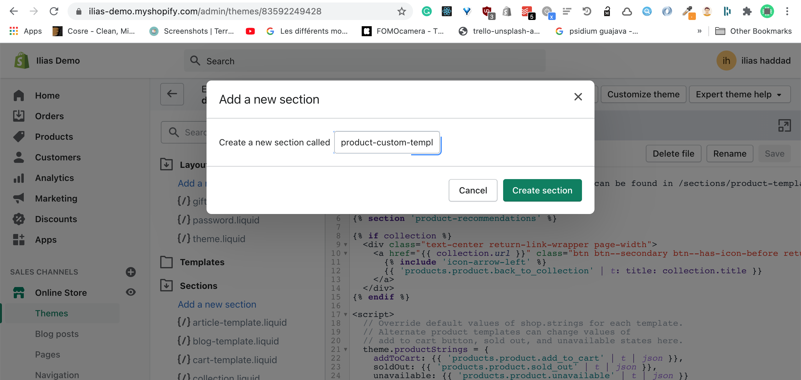
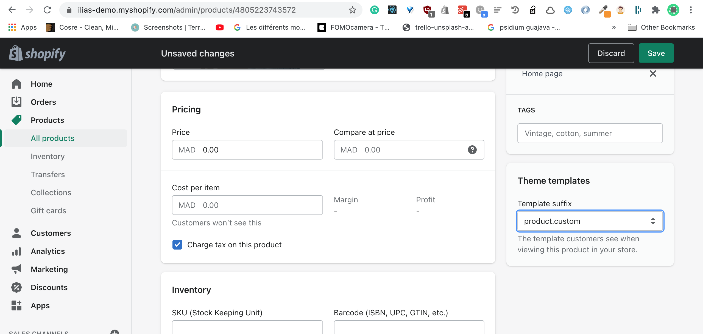
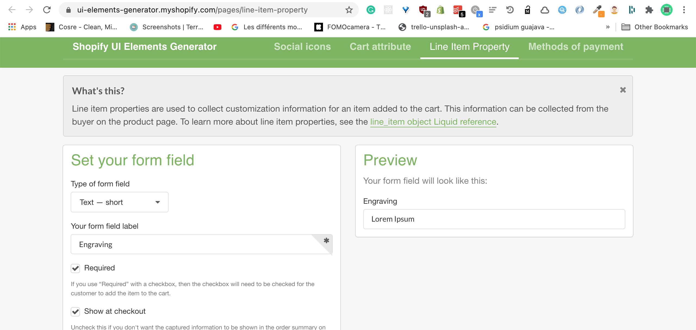
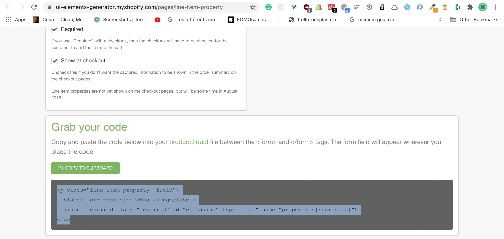
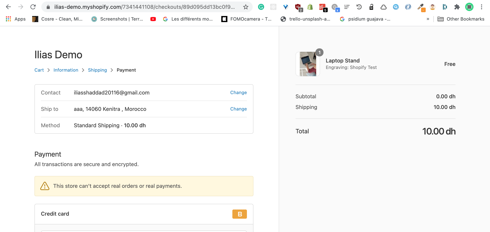

In the third article of #4weeksShopifyDev, I'll be talking about how to add custom fields to the order data in the product page

I'll adding engraving custom field in product page and display the output of the customer in order page (Shopify Admin)

Demo Image

Note: I'm using the Debut theme, you may have different architecture

## Create a product template

- First, we need to create a custom product Shopify template and called product-custom.liquid
  

- Create a new Shopify section and called product-custom-template and paste the code from the product-template section
  

- On the product page , change the template suffix to the product.custom

  

## Create Custom Fields

- Go to the [Shopify UI Elements Generator](https://ui-elements-generator.myshopify.com/pages/line-item-property).
- Create a new custom field
  

- Copy the generated code
  

- Paste the code before <button type="submit"

Now, you can test it by adding the product to the cart and add the custom field value and process the checkout.

Et voila, the custom field value appear on the checkout page and order page

