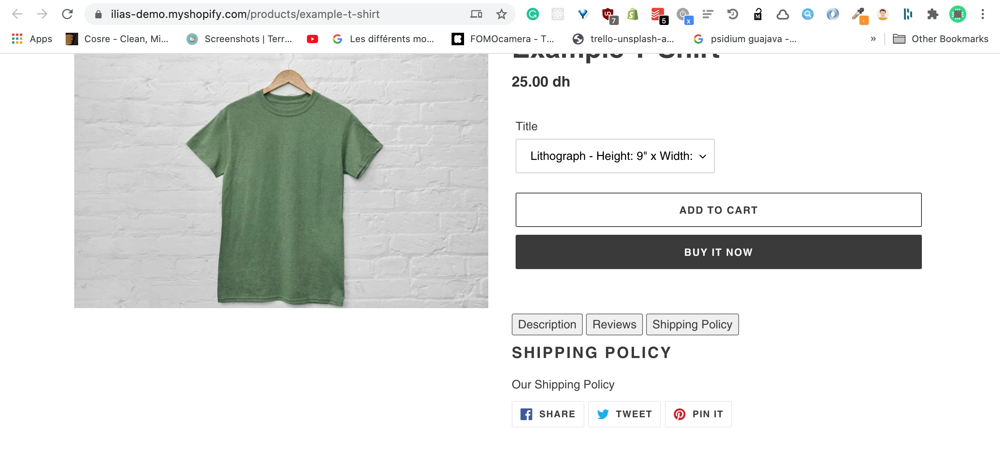
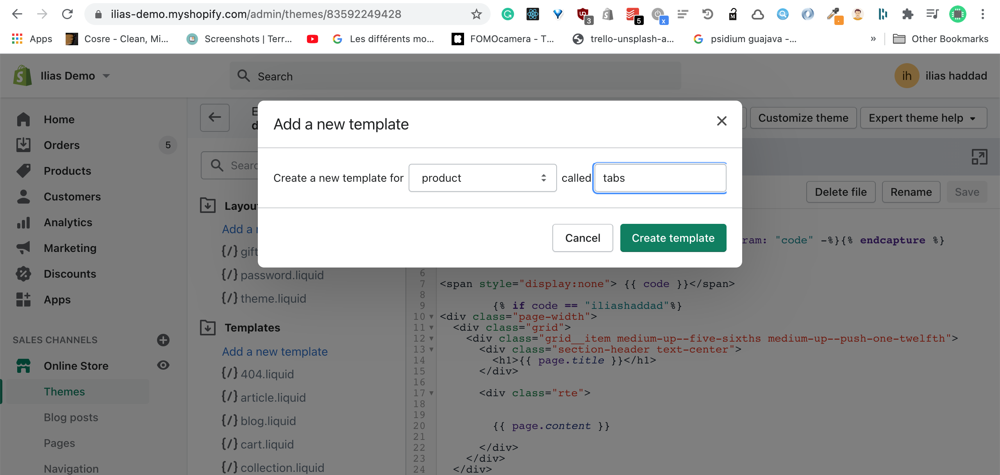
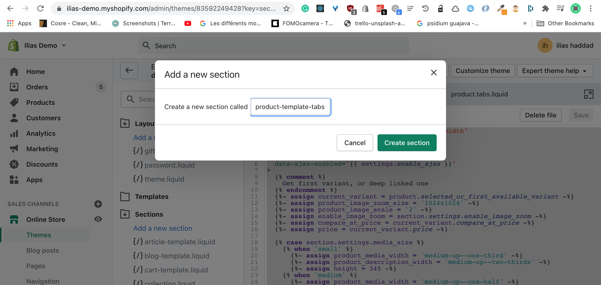
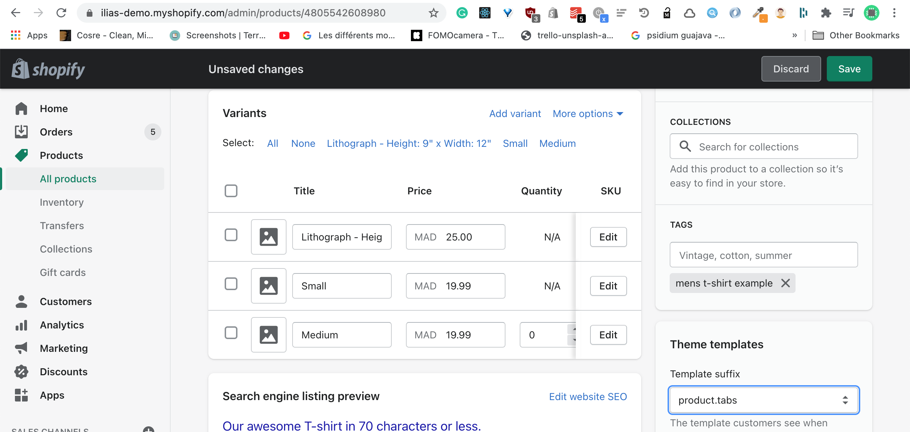

In the fourth article of the #4weeksOfShopifyDev challenge, I'll be talking about to add product tabs without using a Shopify app

Note: I'm using the Debut theme, you may have different Shopify theme

[Demo Product Page](https://ilias-demo.myshopify.com/products/example-t-shirt)



## Create a product template

- First, we need to create a custom product Shopify template and called product-tabs.liquid
  

- Create a new Shopify section and called product-template-tabs and paste the code from the product-template section
  

- Change the section in product-tabs.liquid to product-template-tabs
  

## Install reviews app and configure tabs

- Install [Shopify product reviews app](https://apps.shopify.com/product-reviews)

* Create new Shipping policy page
  

* Replace {{ product.description }} in product-template-tabs.liquid with this code

```
 <div >
  <button onclick="openTabs('Description')">Description</button>
  <button  onclick="openTabs('Reviews')">Reviews</button>
  <button onclick="openTabs('Shipping')">Shipping Policy</button>
</div>
     <div style="margin:10px 0;" id="Description" class="tab">
  <h2>Description</h2>
{{ product.description }}
</div>

<div style="margin:10px 0;display:none" id="Reviews" class="tab" >
  <h2>Reviews</h2>
<div id="shopify-product-reviews" data-id="{{product.id}}">{{ product.metafields.spr.reviews }}</div>
</div>

<div  style="margin:10px 0;display:none;" id="Shipping" class="tab" >
  <h2>Shipping Policy</h2>
  {{pages['shipping-policy'].content}}
</div>

      <script>

        function openTabs(tabName) {
  var i;
  var x = document.getElementsByClassName("tab");
  for (i = 0; i < x.length; i++) {
    x[i].style.display = "none";
  }
  document.getElementById(tabName).style.display = "block";
}
      </script>

```

Et voila, you have product tabs without a Shopify app
