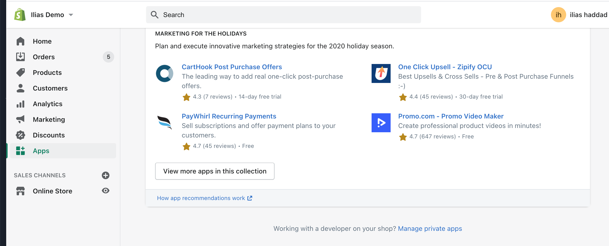
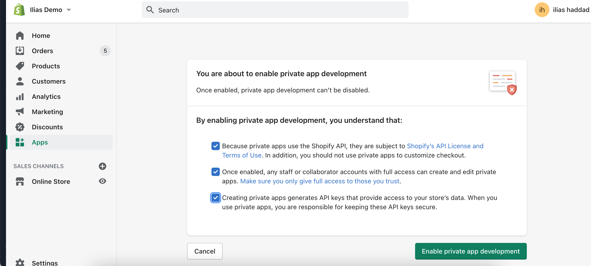
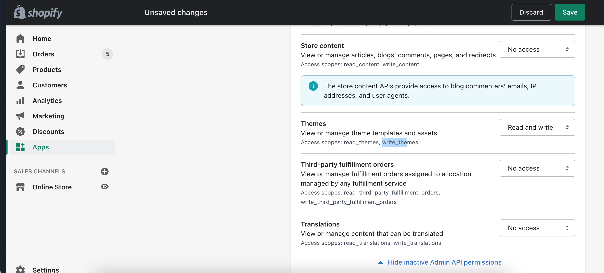
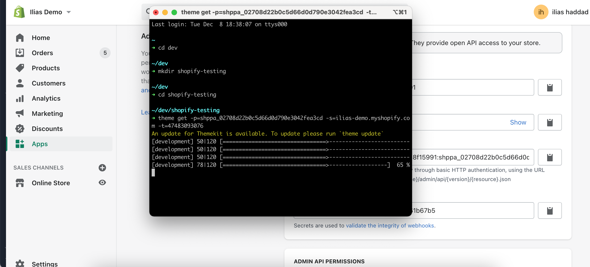

In the 12th article of the #4WeeksOfShopifyDev challenge, I'll talking about how you can add tailwind css to your Shopify theme and add only used Tailwind CSS code in your liquid code.

Let's do it!

- First, we need to download your Shopify theme locally using Shopify themekit

## Install ThemeKit

ThemeKit is the Offical Shopify tool to work with Shopify themes locally

macOS Installation

```jsx
brew tap shopify/shopify

brew install themekit
```

Windows Chocolatey Installation

```jsx
choco install themekit
```

Linux Installation

```jsx
curl -s [<https://shopify.github.io/themekit/scripts/install.py>](<https://shopify.github.io/themekit/scripts/install.py>) | sudo python
```

## Create Private Shopify App

- Go **Admin > Apps** and click on manage private apps at the bottom of the page
  

- Click on Enable Private App Development and enable it
  

- Create a new private app and select Themes with reading and write permissions
  

* Copy the Password

Configure ThemeKit

- Go **Online Store > Themes** and click on edit code for the Shopify theme you want to work with locally
- In the URL bar, you'll have the Shopify theme ID like this one [https://ilias-demo.myshopify.com/admin/themes/](https://ilias-demo.myshopify.com/admin/themes/)ID

Create a directory for this theme

Run this command to download your theme code

```jsx
theme get -p=your-password -s=[you-store.myshopify.com](<http://you-store.myshopify.com/>) -t=your-theme-id
```



In the theme directory, we need to initialize a node js project (You should have Node JS installed)

- Run this code to create new package.json file

```bash
npm init -y
```

- We need to install these dependecies to add tailwind css

```bash
npm install tailwindcss autoprefixer postcss
```

- Run this command to create tailwind.config.js file

```bash
 npx tailwindcss init
```

- Paste this code to add only used CSS classes in your Shopify theme file

```jsx
module.exports = {
  purge: {
    enabled: true,
    content: ["./**/*.liquid"],
  },
};
```

- Create new file called postcss.config.js file

```jsx
module.exports = {
  plugins: {
    tailwindcss: {},
    autoprefixer: {},
  },
};
```

- Create new folder called css and create new file under this directory called application.css
- Paste this code to import Tailwind CSS code

```css
/* purgecss start ignore */
@tailwind base;
@tailwind components;
/* purgecss end ignore */

@tailwind utilities;
```

- Run this code to build the tailwind CSS code and you'll get application.css.liquid file which contains all tailwind CSS code needed for your theme

```bash
npx tailwindcss build css/application.css -o assets/application.css.liquid
```

- You need to add the tailwind CSS build code to your Shopify theme by adding this code to your theme.liquid file

```bash
{{ "application.css" | asset_url | stylesheet_tag }}
```

- Run this command to upload the new files and change and watch for new changes to your remote Shopify theme

```bash
theme watch
```

- You can add this code in package.json under scripts and it's will build tailwind css code and deploy the theme

```bash
"build": "npx tailwindcss build css/application.css -o assets/application.css.liquid && theme deploy"
```

If you enjoyed this article, don't forget to share it with other people 😇
