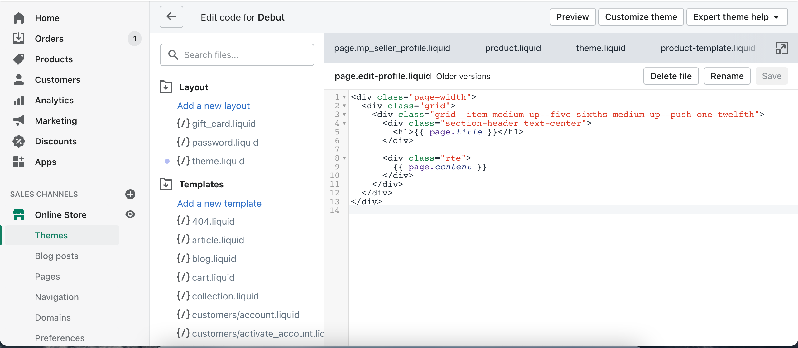
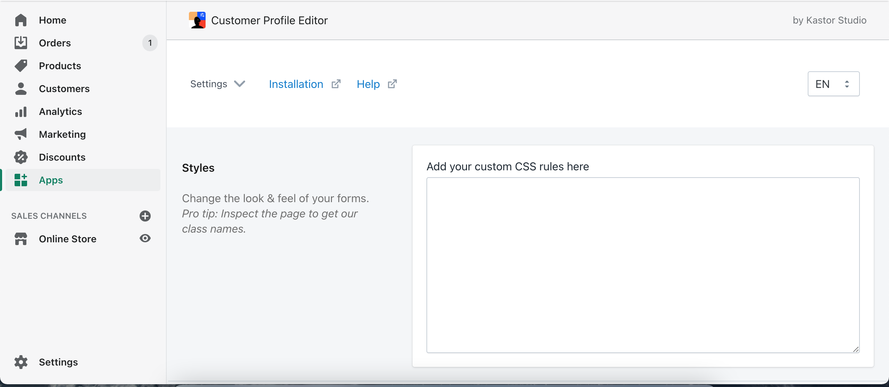
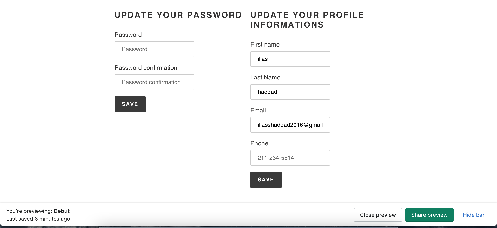
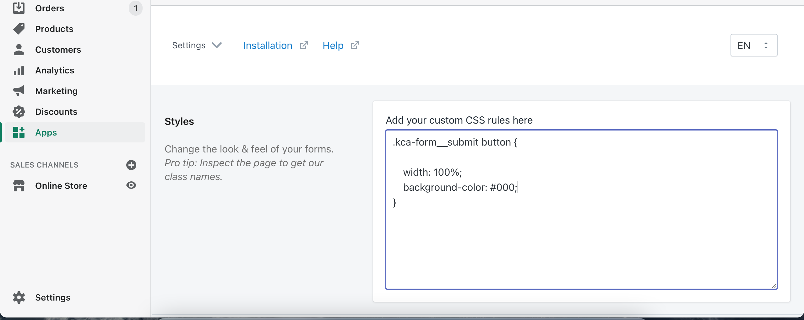

In the next four weeks, I'm planning to start a challenge it will be called #4weeksOfShopifyDev. In this challenge, I'll write technical articles related to the Shopify theme and app development.

The majority of the upcoming articles are from previous Shopify store clients I worked with

In today's article, I'll be talking about how to allow your Shopify store customers to edit their info without calling your customer support.

[Demo Page](https://ilias-haddad-test.myshopify.com/pages/edit-profile)

### Install the Shopify app

First, we'll use a Shopify app to allow customers. they have a free plan.


### Configure the Shopify app

To allow your customers to edit their info, we have two solutions
Inject the code on an exciting page
Create a new page to edit the profile

In this article, I'll go with the second solution.

- Create a new page template it will be called edit-profile



- Inject the Shopify app code to display the form

```
<div id='kca-embed'></div>
```

- Create a new Shopify page and choose the page. edit-profile as page template
- Now, we have the edit account form loaded as we want, but we need to match the style of the form to our design

  

- Click on the settings dropdown menu and choose custom css

  

- Inspect the console on the edit profile page
- Style the input and label element with your own css style and paste them into the app



I hope you find this article useful. I'll be writing more technical in the next 4 weeks. if you joined me in this challenge, You can find me on Twitter or Instagram
