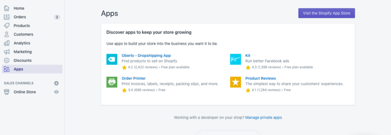

In the 10th article of #4weeksOfShopifydev challenge, I'll be talking about how to create an eCommerce store using Shopify as a headless CMS and Gatsby JS

In 2020, people are buying more products online due to the lockdown and many businesses are forced to switch to online mode to survive during this pandemic

COVID 19 accelerated e-commerce growth by 10 years - Forbes

With more people buying using online channels, businesses need to focus more on delivering a great experience to their online clients.

To have a good experience for your clients, you should optimize your online store in the front end (What clients see, the checkout experience from searching for the product to place the order) and in the back end (handle orders and shipping the items).

### What is Headless Commerce?

As we mentioned above, the online store has two parts (what client see on the website) which are called a front end and (how the client order as processed and shipped, product management) which is called the back end.

Headless Commerce is separating the front end from the back end, you can use any tool you want for each part to optimize your online store for better conversion

### Why Should I consider moving to Headless Commerce?

- You have extreme performance requirements
- You want to design/UX flexibility
- You need a PWA
  - By 2021, analysts estimate 53.9% of all eCommerce sales will happen on mobile devices. (source)
  - PWA has numerous key features that make them different from traditional web applications. For example, it allows using the application in an offline mode and sending push notifications to customers’ mobile devices. It also creates an app-like icon on the mobile device, which facilitates access to the store.
- Use any front end stack you want (React, Vue, Angular, Gatsby)
- Build a CI/CD pipeline for your front end store
- Better speed performance:
- Use any SSG tool to build a high performant eCommerce store without compromising the user experience
- Better SEO performance:
- With headless you can manage and control the following SEO parameters:

1. Customize robots.txt
2. Customize web server headers
3. Customize URL structure
4. Breadcrumb URLs
5. Custom Sitemap.xml
6. Unlimited subcollections/subcategories
7. Global redirects

### Why use Shopify for headless commerce?

- The checkout experience
- With over 2.5 billion orders processed, Shopify Checkout is constantly optimized for speed, conversion, and customer experience–giving you the most powerful checkout in the world. — [Shopify](https://www.shopify.com/checkout)
- Product Management:
- You can use the Shopify product management dashboard to edit, add and remove products
- Shopify apps:
- you can still use Shopify apps to manage your inventory, orders, and all back end stuff but you can't use Shopify apps that interact with Shopify store front end
- Customer and order management
- You can use the Shopify account system to create and login customer accounts and handle all orders using the admin dashboard

Going headless with your Shopify store by creating a custom static storefront will give you – apart from things already mentioned – a bunch of benefits. Your online business will grow because of:

- A lower number of abandoned carts
- Increasing organic traffic
- Decreasing acquisition cost
- Being fully omnichannel
- Easy A/B testing
- Enhanced digital marketing options

### How I build a Shopify store with Gatsby JS?

The requirement for this tutorial

- a Shopify Store
- Basic knowledge of how to build Gatsby website

Demo Store: [https://ilias-shopify-gatsby.netlify.app/](https://ilias-shopify-gatsby.netlify.app/)

### **Setup new Gatsby Website**

```javascript

 gatsby new shopify-store [https://github.com/IliasHad/gatsby-shopify-starter](https://github.com/IliasHad/gatsby-shopify-starter)

```

### Get API access token to your Shopify shop


Click on Manage Private Apps

Click on manage private apps > Create a new private app


Allow Gatbsy to read your Shopify store data

After the private app is created, you will get an API key to access your Shopify store data

```javascript

 SHOP_NAME=YOUR SHOPIFY STORE NAME
 SHOPIFY_ACCESS_TOKEN=YOUR API KEY

```

You need to change the environment variable in .env.development file (if you want to just test a demo) and in .env.production with production store API key and name

SHOP_NAME is your Shopify store name. for example, my Shopify store is ilias-gatsby.myshopify.com. the Shopify store name is ilias-gatsby

SHOPIFY_ACCESS_TOKEN is the API key you got when you created the private application

Finally, you need to run gatsby develop to run the website

```javascript

  gatsby develop

```

You could use Tina CMS to give the store owner the ability to edit their content and have Shopify theme editor similar experience
If you need any help with your Shopify store, you can contact me at [contact@iliashaddad.com](mailto:contact@iliashaddad.com)

Are you considering switching from traditional commerce to a headless eCommerce solution for your online brand? We’re happy to help.

Please **[get in touch](https://www.diffagency.com/pages/contact-us)** for more information on our headless commerce services.

### References

[Headless Commerce Using Shopify Plus | We Make Websites](https://wemakewebsites.com/blog/headless-commerce-using-shopify-plus/)

[Beyond the Shopify Storefront: Headless Commerce Considerations](https://www.youtube.com/watch?v=kKZ_-9tM6dg)

[Headless Shopify Explained: 22 Inspiring Must See eCommerce Site Examples](https://www.jamchefs.com/blog/headless-shopify)

[The Future of E-commerce is Headless](https://www.youtube.com/watch?v=s3hDghdIiFY&list=PLzlG0L9jlhEPV9w1x68jm1c79fBzhZCoF&index=1&t=2s)

[Why Use Shopify Only as a Headless eCommerce? - Pagepro Blog](https://pagepro.co/blog/why-use-shopify-only-as-a-headless-ecommerce/)

[Headless Commerce on Shopify: Paul Valentine's Journey](https://www.youtube.com/watch?v=vf0XF_1Kf4w)

[How To Build A Shopify Headless eCommerce Storefront](https://medium.com/selleo/how-to-build-a-shopify-headless-ecommerce-storefront-99b9dfd5204b)
