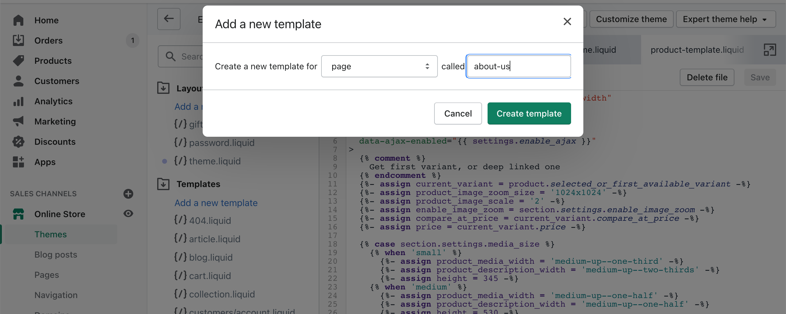
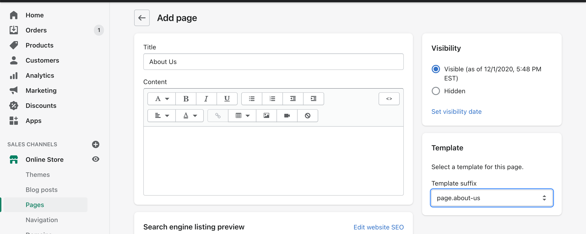
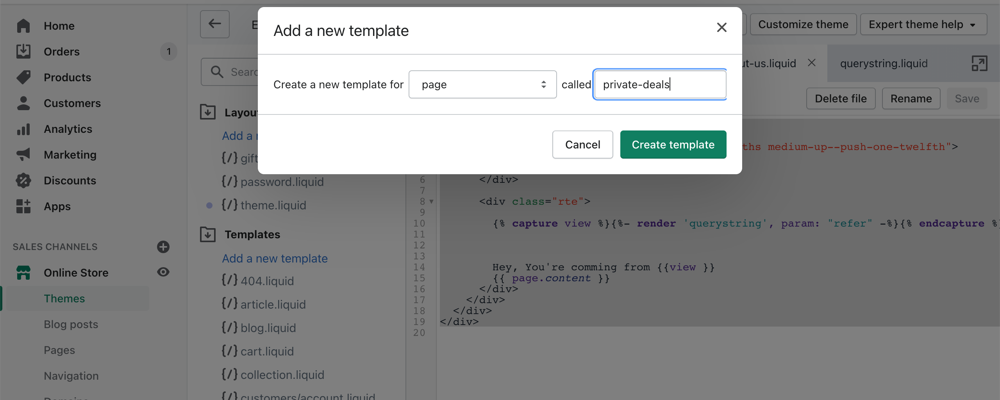
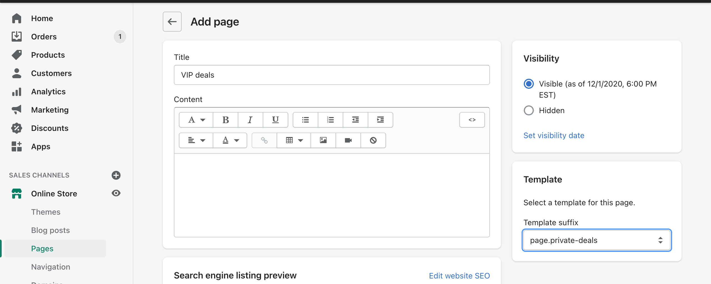

In the next four weeks, I'm planning to start a challenge it will be called #4weeksOfShopifyDev. In this challenge, I'll write technical articles related to the Shopify theme and app development.

The majority of the upcoming articles are from previous Shopify store clients I worked with

In today's article, I'll be talking about how to show content on a custom Shopify page based on the URL query.

For example, a Shopify client want to show dynamic content based on the URL query

[Demo Page for the first part](https://ilias-haddad-test.myshopify.com/pages/about-us?refer=facebook)

[Demo Page for the second part](https://ilias-haddad-test.myshopify.com/pages/vip-deals?code=iliashaddad)


### WARNINGS (SERIOUSLY)

Shopify will cache the output of pages. If you use this querystring parsing code to show/hide content on the site you risk exposing the result to all customers. Imagine you have a discount code shown with the querystring. If Shopify caches that output version every single customer will see the code regardless of the querystring in place. The code attempts to avoid that risk by using the cache querystring value but the risk remains.

By using the cache querystring value you're no longer making use of the Shopify cache. This is what helps keep your site fast, and perform well under load. Flushing the cache isn't a great idea - especially at scale.

Also, you have no control over what content appears in content_for_header. Shopify could change the contents at any point so this code could stop working.

It's for those reasons (and mainly the first two) that I would strongly caution you against using it on a production site. It's still an interesting idea in any case.

Let's start!

- Create a new Shopify page template

  

* Create a new Shopify page and link it with the custom template

  

* Create a new snippet called querystring paste this code on it

```
{{ content_for_header }}
{%- assign pageUrl = contentForQuerystring | split:'"pageurl":"' | last | split:'"' | first | split:'.myshopify.com' | last |
   replace:'\/','/' |
   replace:'%20',' ' |
   replace:'\u0026','&'
-%}


  
  
  
  
    
    
      {{keyAndValue[1]}}
```

- Include the snippet in the custom page we created before

```liquid


```

- Paste this code in the custom page

```
<div class="page-width">
  <div class="grid">
    <div class="grid__item medium-up--five-sixths medium-up--push-one-twelfth">
      <div class="section-header text-center">
        <h1>{{ page.title }}</h1>
      </div>

      <div class="rte">

        


        

        Hey, You're comming from {{view }}
        {{ page.content }}

        
      </div>
    </div>
  </div>
</div>
```

Et voila, you have a dynamic page based on URL query

In the next part of this article, I'll make a custom Shopify page and you can only access it if you have a code in the URL query.

For example, you have a custom deal for specific visitors and you want only these visitors to see this deals page.

Let's do it!

- Create a new Shopify page template
  

- Create a new Shopify page and link it with the custom template



- Create a new snippet called querystring paste this code on it

```
{{ content_for_header }}
{%- assign pageUrl = contentForQuerystring | split:'"pageurl":"' | last | split:'"' | first | split:'.myshopify.com' | last |
   replace:'\/','/' |
   replace:'%20',' ' |
   replace:'\u0026','&'
-%}


  
  
  
  
    
    
      {{keyAndValue[1]}}
```

- Include the snippet in the custom page we created before

```liquid


```

- Paste this code in the custom page

```



        
<div class="page-width">
  <div class="grid">
    <div class="grid__item medium-up--five-sixths medium-up--push-one-twelfth">
      <div class="section-header text-center">
        <h1>{{ page.title }}</h1>
      </div>

      <div class="rte">


        {{ page.content }}

      </div>
    </div>
  </div>
</div>

        
```

Now, if you visit the custom deals with the code in URL query string https://ilias-haddad-test.myshopify.com/pages/vip-deals?code=iliashaddad

### References

- [Access querystring in Liquid](https://community.shopify.com/c/Shopify-Discussion/Access-querystring-in-Liquid/td-p/75151/page/2)
- [Freak Design Blog Post](https://freakdesign.com.au/blogs/news/get-the-url-querystring-values-with-liquid-in-shopify)
