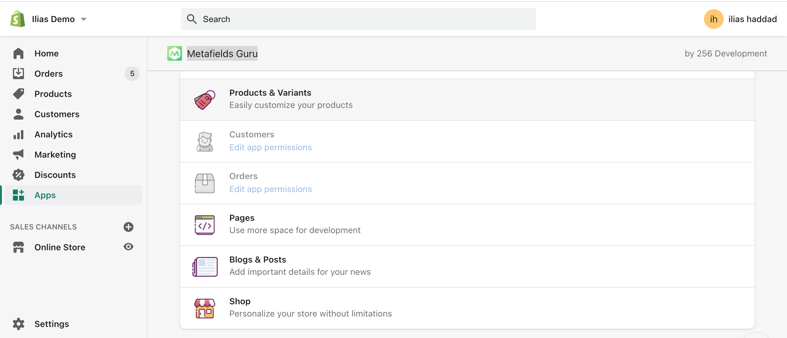
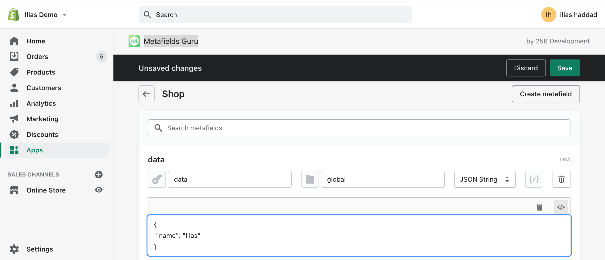

In the 11th article of the #4weeksOfShopifydev challenge, I'll be talking about how to use JSON data in Shopify liquid code.

In Shopify Liquid template language, they don't support JSON or objects (not product object), I have a tip tp use it in Liquid.

- First, we need to install [Metafields Guru](https://apps.shopify.com/metafields-editor-2) app to create metafields
- Create new metafield under Shop settings



- Select JSON string as type and type data as key
  

- Use this JSON sample data

```json
[
  {
    "firstName": "Ilias",
    "lastName": "Haddad",
    "email": "contact@iliashaddad.com"
  }
]
```

- To consume this JSON data in Liquid, you can use this code snippet to render this JSON data

```




{{ user.firstName}}  {{ user.lastName}}  {{ user.email}}


```

In this sinppet, we assign the global namespace metafield to users variable



And we loop over the array of object in JSON by accessing the data key metafield
