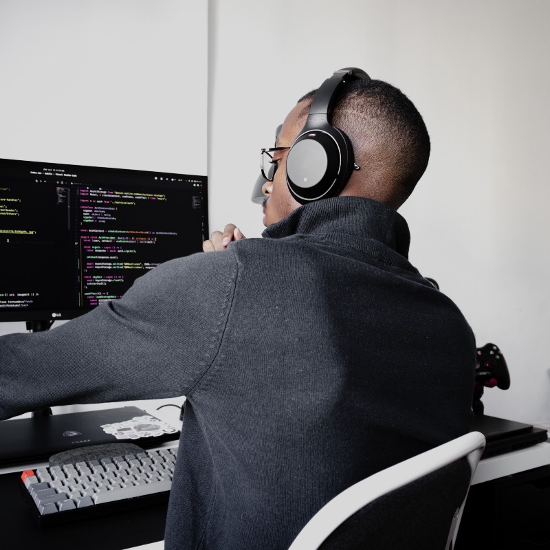
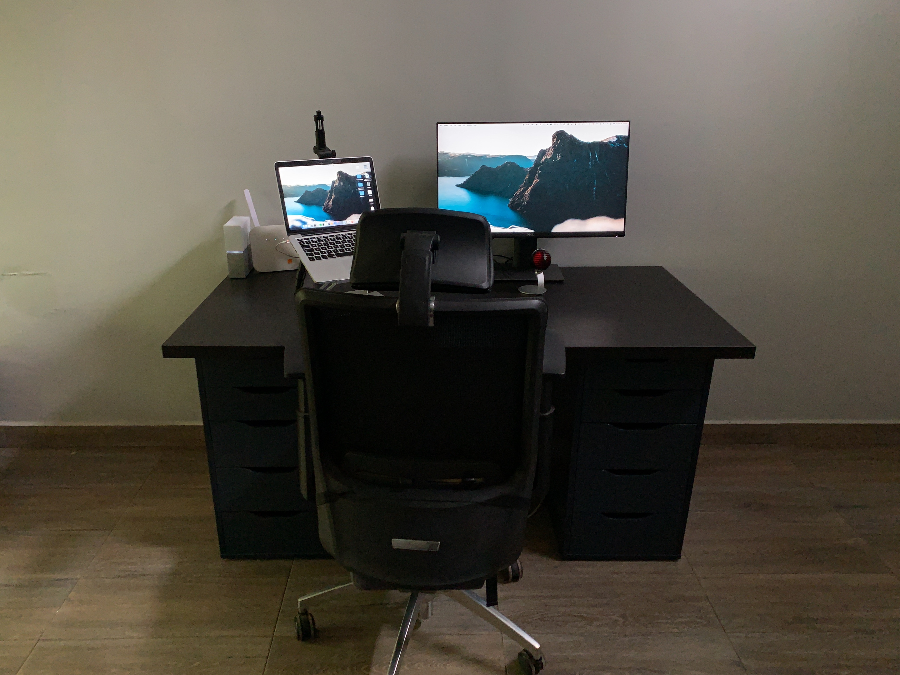

I’ve been working remotely since late 2018. I’ll take you through each piece of hardware and software, and why I like it as a developer and freelancer.

Photo by [Nubelson Fernandes](https://unsplash.com/@nubelsondev?utm_source=unsplash&utm_medium=referral&utm_content=creditCopyText) on [Unsplash](https://unsplash.com/s/photos/developer-setup?utm_source=unsplash&utm_medium=referral&utm_content=creditCopyText)

### **Who I Am?**

I’m Ilias Haddad, a full stack JS developer, and Shopify developer based in Kenitra, Morocco. I’m currently working as a remote freelancer with experience in Shopify development.

### Hardware

### Laptop

I’ve been using a MacBook Pro 2015 i7 3.1 GHz 512 GB as my main computer

### Monitor

Monitors are arguably the most important pieces of hardware in a developer’s setup. As a developer, I need to have an external monitor to have my application for live preview and I use my code editor on the MacBook screen.

I was using Dell P2719h for about 3 months and it’s a good quality Monitor for developers.

### Desk

I watched a lot of tech setups on YouTube and Instagram and I got impressed with [LINNMON / ALEX](https://www.ikea.com/us/en/p/linnmon-alex-table-black-brown-blue-s29304020/) desk from Ikea. With this desk, I have a number of drawest to store my accessories for easy access.

### **NAS server**

I have 512 GB in my MacBook Pro and 128 GB in my iPhone. I need a NAS server to backup all this data in case of my MacBook Pro failed. I brought a home cloud server from WD and it’s working great on iPhone but not with MacBook Pro with Big Sur.

### Microphone

I used the [Shure MV5](https://www.shure.com/en-MEA/products/microphones/mv5) microphone for the untreated room and it’s working great if you reduce the microphone gain.

### WebCam

I used my iPhone as my webcam because the built-in webcam isn’t looking good. I use [Iriun](https://iriun.com/) to be able my iPhone as a webcam.

### Software

### Desktop Apps

- [Spark:](https://sparkmailapp.com/) I love using this email client and it’s my favorite one so far.
- [Notion:](https://www.notion.so/) I use Notion to store all things like podcast notes, new projects ideas, content calendar, books list, Goals
- [Loom:](https://www.loom.com/?ref=ilias-haddad) You can record your screen and get a video URL of your recording when you stop recording.
- [Krisp:](https://ref.krisp.ai/u/u887933010) You can remove all the noise in your environment on your microphone or speaker in realtime.
- [Postman:](https://www.getpostman.com/) You can test or debug your APIs easily with Postman. I usually start with the backend first, I use potman to interact with my APIs and then create the front end.
- [Visual Studio Code:](https://code.visualstudio.com/) My favorite code editor ever, I use it everything for my personal and client projects.
- [There:](https://there.pm/) I have clients in different locations and I need to check their time every time on google. I use there to my clients time right from the menubar

### Chrome Extensions

- [Grammarly:](http://grammarly.com/) I use Grammarly for about a year and it saves a lot of time googling my grammar issue
- [Shopify theme file search:](https://chrome.google.com/webstore/detail/shopify-theme-file-search/mhchmhfecfdpaifljcfebnlaiaphfkmb?hl=en) As a Shopify developer, I use the Shopify code editor to edit without downloading the theme code when I don’t have access to private apps to make a local dev env. I use this extension to search for a word in the theme code and it saves a lot of time downloading and reuploading the theme to just use VS search functionality
- [Shopify theme inspector:](https://chrome.google.com/webstore/detail/shopify-theme-inspector-f/fndnankcflemoafdeboboehphmiijkgp?hl=en) I use this extension to debug the liquid code for better performance

### Web Tools

- [Calendly:](https://calendly.com/) I use Calendly to let my clients book a meeting without going back and forth to agree on a meeting time.
- [Plausible:](https://plausible.io/) I use Plausible to keep an eye on personal website analytics with great UI and UX
- [FreshBooks:](https://www.freshbooks.com/) As a freelancer, I need to keep on track of my projects invoice and my expense. I use FreshBooks to manage my freelance business income and expense

### **Mobile Apps**

- [Meeter:](https://trymeeter.com/) With this app, I can get a list of upcoming online meeting events from my calendars.
- [Sleep Cycle:](https://www.sleepcycle.com/) I use the sleep cycle to track my sleeping and get data of how many hours I sleep last night.

