Speed plays a major role in the success of any online store.

The faster your store loads, the lower the bounce rate. If your store is fast, you have a better chance of ranking on Google over slow sites that drive high bounce rates.

> Page speed is a critical factor when it comes to [ranking your website](https://neilpatel.com/blog/does-speed-impact-rankings/) higher on Google’s search engine results. — [Neil Patel Seo Expert Blog](https://neilpatel.com/blog/google-pagespeed-insights/)

> [The BBC found they lost an additional 10% of users](https://www.creativebloq.com/features/how-the-bbc-builds-websites-that-scale) for every additional second their site took to load. — [Google Developers Blog](https://developers.google.com/web/fundamentals/performance/why-performance-matters/)

Today, I’ll cover all the ways I use for optimizing Shopify store specifically and I’ll make a new Shopify store to show how exactly optimize Shopify stores for speed. Let’s get started!

### Speed Testing Tools

I forgot to mention some tools for testing your Shopify store speed and Thanks to @[Mari Petrenko](https://medium.com/@maripetrenko) for sharing these tools.

- [Google Speed Insight](https://developers.google.com/speed/pagespeed/insights/)

- [Gtmetrix](https://gtmetrix.com/) **(Recommended)**

#### Warning: These steps need technical knowledge like HTML, CSS, and Javascript

#### Before Start optimizing the Shopify store make sure to download a Shopify theme backup

Admin > Themes > Actions > Download Theme file

and your backup theme will send it to your mail linked with your shopify store

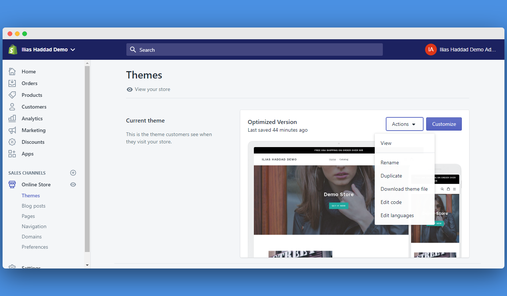
Backup Shopify theme

### 1 — Compress Images

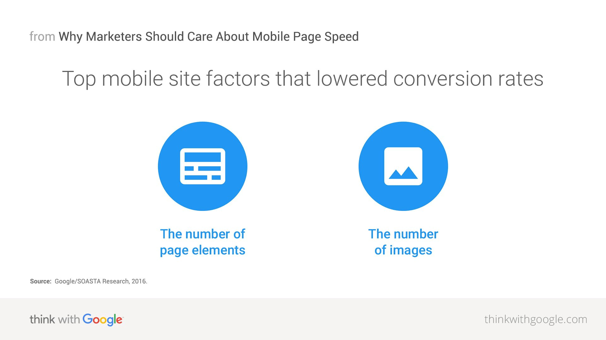

One of the major critical factors that slow your Shopify store or any webpage and reduce your conversion rate is images.

> we found sessions that converted users had 38% fewer images than sessions that didn’t convert. — [Think with Google](https://www.thinkwithgoogle.com/marketing-resources/experience-design/mobile-page-speed-load-time/)

To compress your images you have two options

Use [Shopify apps](https://apps.shopify.com/search?q=compress+image&st_source=#) to compress your images

Or you can use the website to compress your images online and you need to download the image and upload it to the website and once it’s compressed you’ll re-upload it and replace it with the uncompressed image and I usually use [TinyPng](https://tinypng.com) and it’s one my favorite image optimization tool.

**Recommended:** [7 step guide to optimizing images on your Shopify store](https://tiny-img.com/blog/a-simple-7-step-guide-to-optimizing-images-on-your-shopify-store/)

Shopify automatically serves WebP images(WebP is a modern image format that provides superior compression for images on the web) from file formats like PNG and JPEG. — [Shopify Changelog](https://changelog.shopify.com/posts/online-stores-automatically-serve-webp-images)

### 2 — Reduce Number Of Requests

I’m going to break down how to reduce the number of requests. Let’s go

[**Recommended Way**](https://medium.com/@danwebb/better-shopify-theme-development-with-parcel-js-704f17f367fc) **(Better and More Efficient)**

### 3 — Remove Unnecessary Shopify Apps

The majority of Shopify store have a Shopify app installed and some of shopify store owners don’t know that some Shopify may have an impact on your store loading speed and maybe your heart about this tips and you already remove all unnecessary apps but you also need to remove Shopify app files form your theme. some of shopify apps inject they file to your theme automatically when you install the Shopify app

](../../images/shopify-speed-optimization-step-by-step-guide-4.png))
Demo Store Snippet Screenshot by [Screenly](https://www.screely.com)

I uninstalled a Shopify app called [Sales Pop](https://beeketing.com/sales-pop) but I still have the injected files in my demo store theme and you can find the app files in snippet section like in the screenshot above or the assets section like the screenshot below

](../../images/shopify-speed-optimization-step-by-step-guide-4.png)
Demo Store Assets Screenshot by [Screenly](https://www.screely.com)

### 4 — Load Only Visible Images

First of all, Off-Screen images are when a user visits a page and will see your top image first but your the browser will download all unvisible images in your page( invisible images = off-screen images ) and to fix this we have a technique called lazy loading which will load images until the user will scroll down to it and you can see a [demo](https://apoorv.pro/lozad.js/demo/) of this technique and also you may notice this technique in medium website

> Some of shopify theme already have lazy loading implemented in the theme

I’ll use a library called lazysizes to lazy load Off-screen image and also make images responsive

**Step 1:** Copy and Paste this [Code](https://gist.github.com/IliasHad/0082a7f60956c061f4862c3ec991bb11) into app.js file

**Step 2:** Add New Snippet Called Bgset.liquid and copy [this code](https://github.com/Shopify/starter-theme/blob/master/src/snippets/responsive-bg-image.liquid) into this snippet

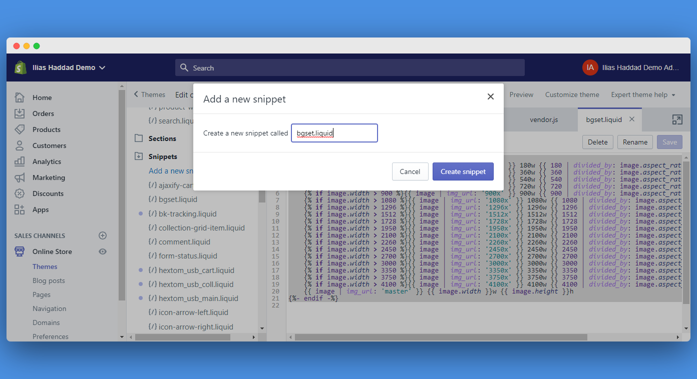

**Step 3:** Add another snippet called responsive-image.liquid


**Step 5:** Copy and paste this [code](https://github.com/Shopify/starter-theme/blob/master/src/snippets/responsive-image.liquid) to the responsive-image.liquid snippet

**Step 6:**

This step is not an easy step for the non-technical persons and I don’t recommend to use it if you don’t know at least Html5 / Css3 and liquid and maybe you’ll have some bugs in your theme.

**You’ll add this code in your img element**

**You’ll add this code if you have a background image**

### 5 — Preload Web Fonts

This technique will preload fonts and once browser need you’ll already have font download and this will decrease loading speed and the browser will not download the font

The majority of website use google web fonts and I’ll also use it for this guide

**Update 07/13/2019:** You can just add the parameters to your google font link and it’s will eliminate render-blocking and skip all others steps for preloading web fonts

Your Google Web Font need to look like this:

```
https://fonts.googleapis.com/css?family=Lobster&display=swap
```

Just add `&display=swap in the end of the url`

### 6 — Preload Js and CSS

The same logic used for preloading web font will be used for javascript and CSS files

Add this code below the web font code

Preload CSS
```javascript
<link rel="preload" href="{{'theme.scss.css' | asset\_url }}" as="style" type="text/css" >
```

Preload Javascript


```javascript
<link rel="preload" href="{{'app.js' | asset\_url }}" as="script" type="text/javascript" >
```
### 7 — Use Google Tag Manager

Finally, we can use google tag manager to organize and manage tags like facebook pixel, Google AdWords pixel, Google analytics and more

**Step 1:** Sign up into G[oogle Tag Manager](https://tagmanager.google.com/#/home)

**Step 2:** Create a Google Tag Manager account

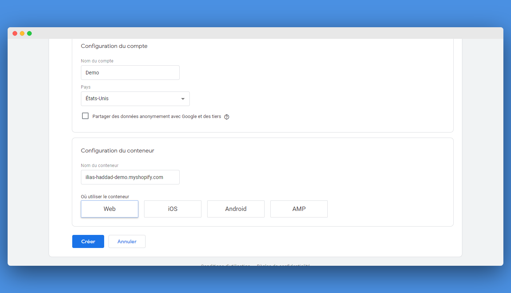

**Step 3:** Add Google Tag Manager Script to your theme.liquid by following instructions mentioned in google tag manager

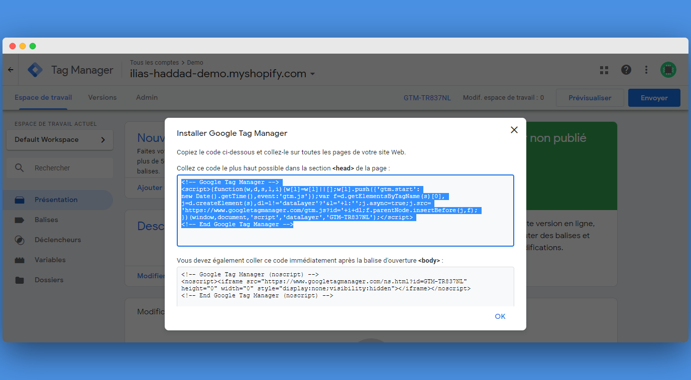

**Step 4:** Add Tracking Tags to Google Tag Manager

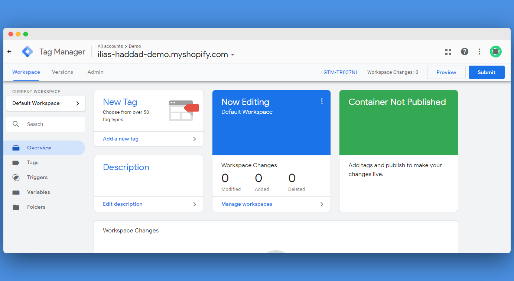

Click on “add new tag” button


Click on the edit button and choose the tag type. For example, if you want to add facebook pixel click on “Custom Html” Tag

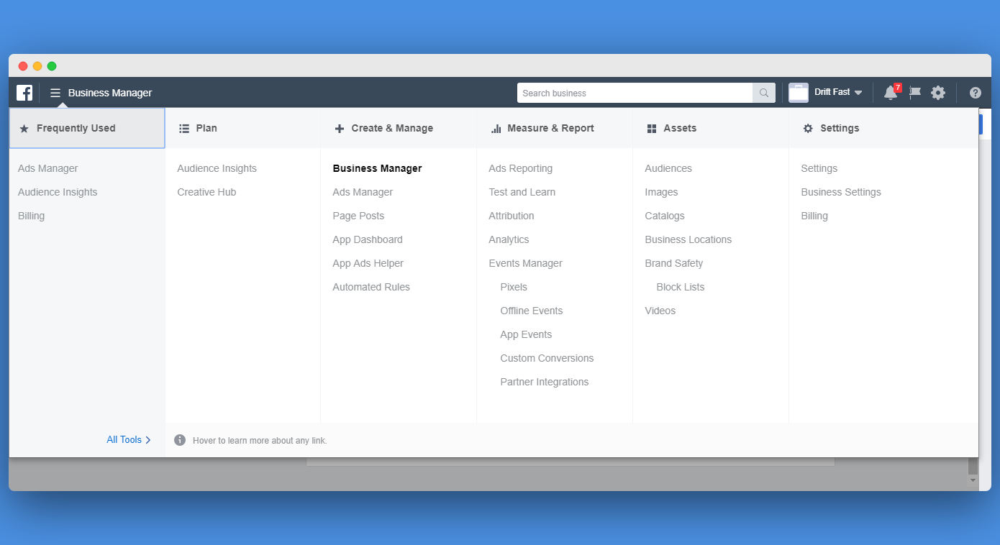

Go to your Facebook Business Manager and Select pixels

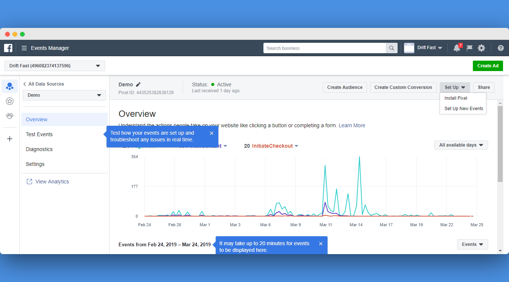

Click on setup drop-down menu and select install setup and choose manual setup and copy and paste the code into google tag manager custom HTML tag or also you can choose to connect to platform partner and choose google tag manager from the list.

Step 4: Choose Trigger

Go to trigger configuration and remove “all pages” trigger

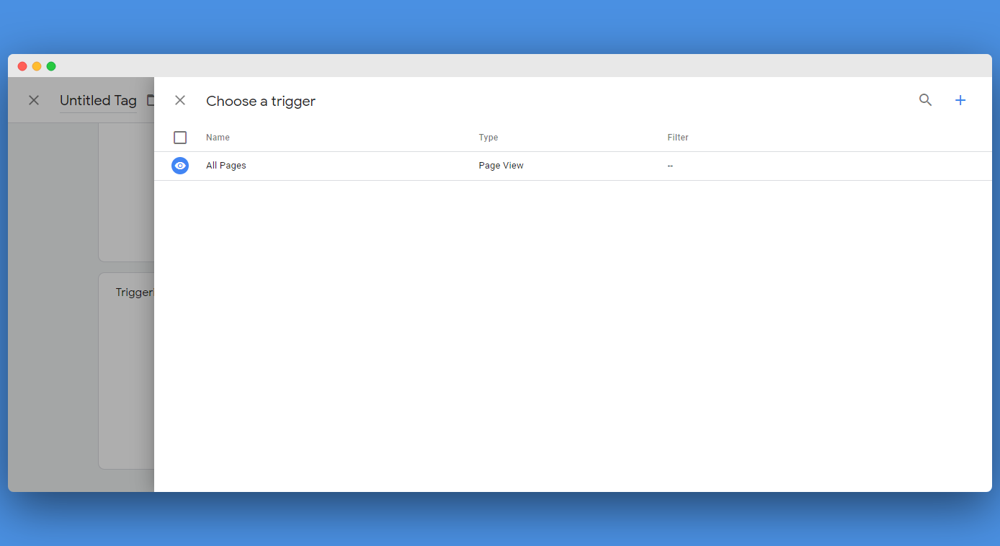

Click on Add Button and Choose Dom Ready

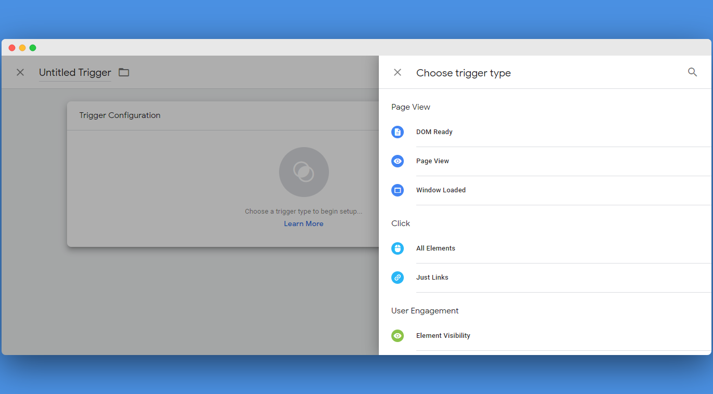
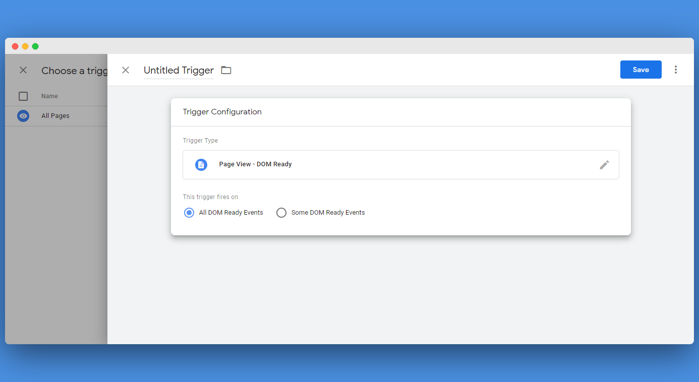

Click Save

### 8 — Update your shopify theme

I receive a useful suggestion to improve the loading speed of a shopify store from @david.simoes and it’s to make sure that your shopify theme is updated because outdated shopify theme may have a lot of outdated JS libraries and which can be replaced with new lightweight library ( Updated ) and may also have some outdated method will a lot affect the speed as mentioned [David Simoes](https://medium.com/u/848e5315c65c). You can contact your shopify theme vendor to get the latest version of your theme

### 9 — Remove Quick Shop Functionality

I receive another great suggestion from [Steven Hudspith](https://www.facebook.com/profile.php?id=100005095034952) The quick shop is good to preview the product but will load more images, Javascript and DOM and I think it’s will not have a good impact on conversion and maybe will hurt loading speed and the user experience and also the conversion rate. I recommended to remove it if you aren’t lazy load images on it

Nb: All techniques mentioned in this guide is tested and I used them on many shopify stores

#### References :

* How Lazy Loading can Optimize Your Shopify Theme Images — [Shopify Blog](https://www.shopify.com/partners/blog/lazy-loading)

* Preload Web Fonts in Shopify Theme — [Sections.design](https://sections.design/blogs/shopify/preloading-fonts)

* How to Improve Page Load Speed on Shopify — [Razorrank](https://razorrank.com/technical-seo-resources/how-to-improve-page-load-speed-on-shopify-razor-rank/)

* Lazy Loading Images and Video — [Google Web Performance](https://developers.google.com/web/fundamentals/performance/lazy-loading-guidance/images-and-video/)

* Suggestions to optimize website loading speed — [Google Web Performance](https://developers.google.com/web/fundamentals/performance/why-performance-matters/)

* Improving Load Performance — [Chrome DevTools 101](https://www.youtube.com/watch?v=5fLW5Q5ODiE&t=681s)

* Web performance made easy — [Google I/O ’18](https://www.youtube.com/watch?v=Mv-l3-tJgGk)

**Update 07/13/2019**

* We shipped font-display to Google Fonts! — [Addyosman](https://addyosmani.com/blog/google-fonts-font-display/)

Let me know if you found this valuable. Curious to hear your speed score after implementing this technique

If you have any questions.

Feel free to contact me at [Twitter](https://twitter.com/IliasHaddad3)

Have a nice day!

Ilias

My Social Links:

* [Twitter](https://twitter.com/IliasHaddad3)

* [Linkedin](https://www.linkedin.com/in/ilias-haddad/)

