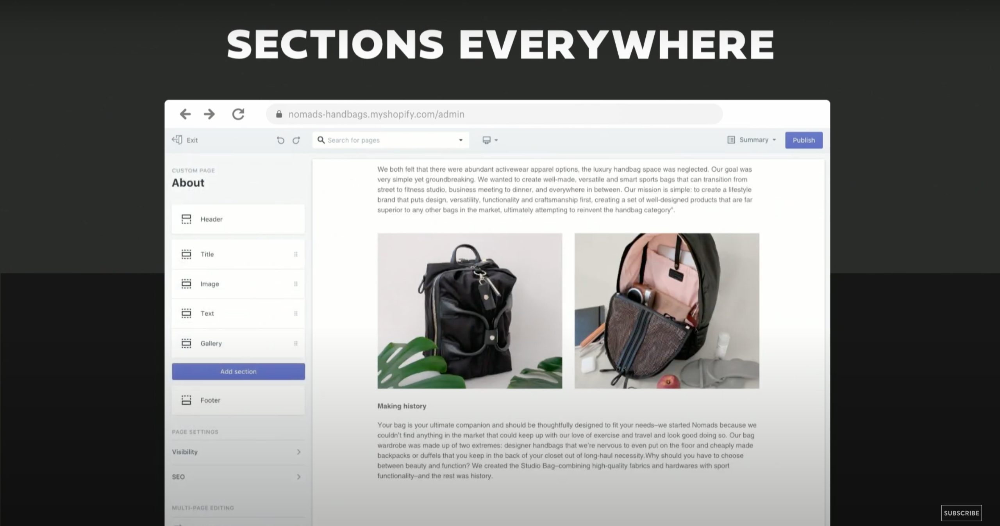
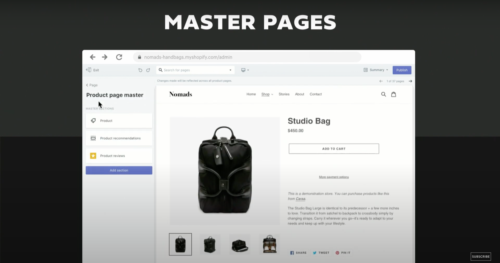
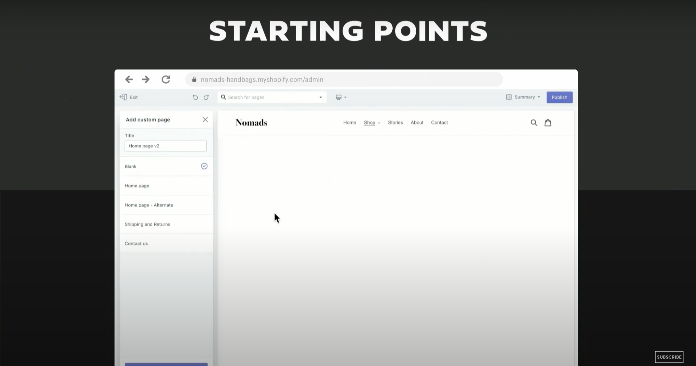
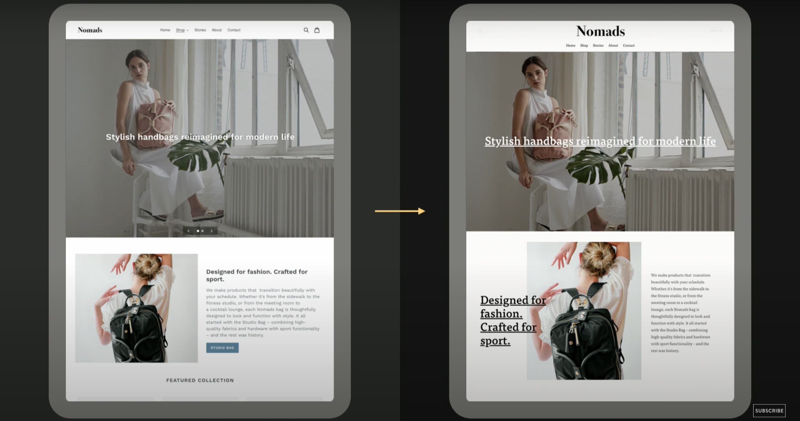
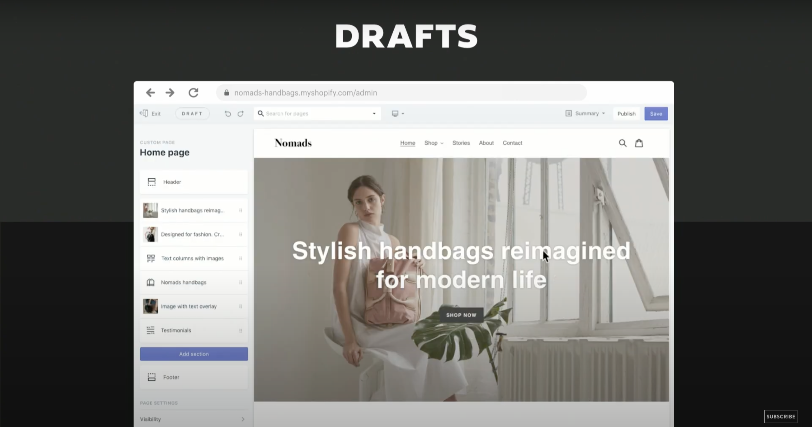

In the eighth article of #4WeeksOfShopifyDev challenge, I'll my review about the new Shopify store design experience review

in Shopify Unite 2019, Shopify launches the new Shopify store for Shopify partners to test out this new experience and give feedback about it to improve it over time.

### Sections Everywhere

- Add, remove and rearrange sections through Shopify theme editor on all pages and not the only home page

  

### Master Pages

- The master page is like the template in the previous architecture but with these new updates, you can have a master product page for all products with product info and you can add or change dynamic section for each product page without the need for custom alternate templates
- You can change sections for each product page and have different sections for each product using only Shopify theme editor without the need for custom alternate templates

  

### Starting Points

- With this new feature, merchants can easily add a new page from Shopify theme editor and select a starting point, for example, a contact page and add, remove and rearrange sections on it without adding a line of code

  

### Content Portability

- Standardized Shopify theme settings and sections, you can easily switch theme without losing previous theme settings

  

### Drafts

- You can see changes you made in Shopify theme editor before publishing the theme and whiteout duplicating the theme

  

### Conclusion:

As a Shopify Partner and Developer, I think this new Shopify store experience will unlock a new set of capabilities for entrepreneurs using Shopify and will give them more creativity and freedom to make the best from their Shopify store

References:

- [Introducing: A New Store Design Experience (Shopify Unite Track Session 2019)](https://www.youtube.com/watch?v=HlpOGQrRBPY)
- ["Sections Everywhere" - Shopify's New Store Design Experience [Explained]](https://www.youtube.com/watch?v=IIXfzaBJngw)
