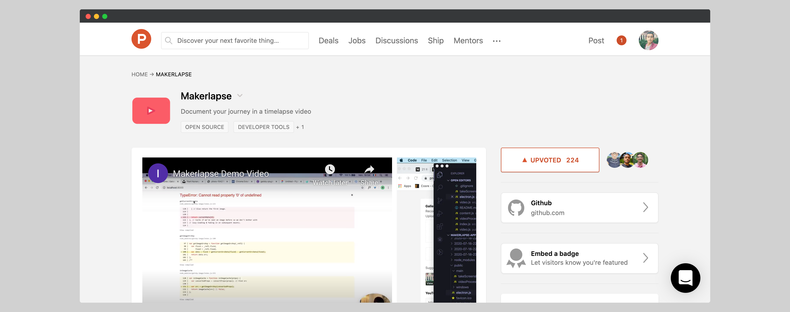

# Makerlapse

### Story 

I watched a video from Devon Crawford about automating his process of video editing using FFmpeg and, I already watch a lot of speed coding videos, also a video about the journey of Pieter Levels while building Hoodmaps and a video about the journey of Guilherme Rizzo while building CSS Scan and I got excited about documenting my journey in a timelapse video

`youtube:https://www.youtube.com/watch?v=digvvOKY3JU`

### Building

Indie hackers members recommend using what I already when I built Habitscript and it’s will save a lot of time. You need to use tools and programming language you already knew and familiar it.

I already have some experience in Node js, so I decided to use an electron in which I can build a cross-platform (Windows, Mac, Linux desktop app with the same code) desktop app.

After about 5 days I built makerlapse and it’s run correctly like I want to be.

But, I iterate it over time to improve it  in terms of video quality and user experience

### Challenges

I want to publish Makerlapse to Mac OS Catalina. I got rejected many times but I'm still trying to get an Apple Developer Membership because I love building mac apps and it's a good market to invest in

### Launch

I launched MakerLapse so many times. the first time, it's was  a paid app and then I decided to make it open source because I want to get into the open-source industry and how it's working behind the scenes 

I launched the latest version on [Product Hunt](https://www.producthunt.com/posts/makerlapse-2) and I got 220+ upvotes and great feedback , 120+ [Github starts ](https://github.com/IliasHad/makerlapse-app) and +1k views on the [launch video ](https://www.youtube.com/watch?v=digvvOKY3JU)

