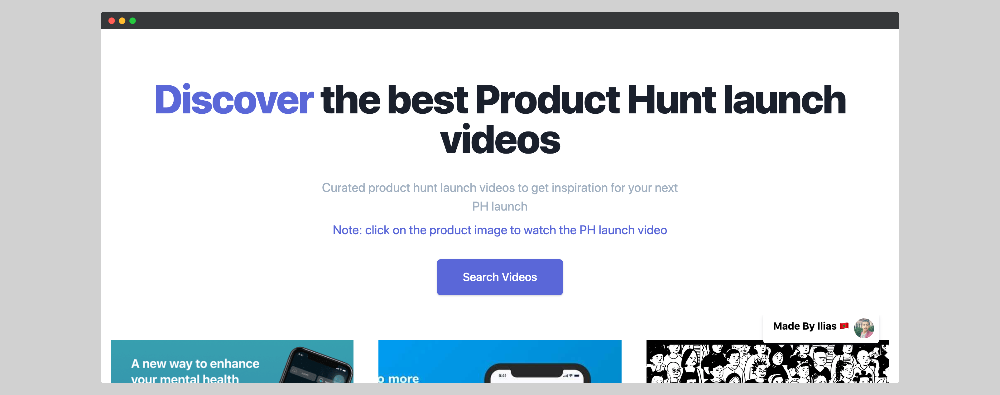
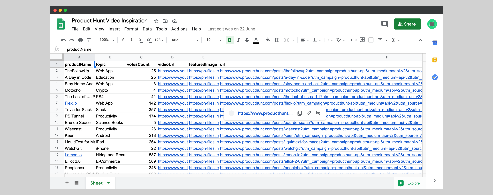

# Product Hunt Launch Video Gallery

### Story 

While I'm working on my side projects and I decided to launch it on Product Hunt to get early users for my app and feedbacks about my idea. I faced a problem when preparing for the launch which, is the launch video.

So, I deiced to check websites to get some inspiration and, I found this [website](https://spectacle.is/) which, a gallery of successful launch videos but, this website doesn't have a lot of videos.

After doing some research, I found that I can use the Product Hunt API to get data about products launched with the launch video.

### Building

I choose the JamStack because I was already familiar with and especially Gatbsy JS but, I need DB to store product hunt data because I have limit API calls. So, I choose a free one which, is Google Sheets.

So, I built a node js server that consumes data from Product Hunt Video and stores the data like in this screenshot.

I built the front end using Gatbsy JS and, I use the google source sheets plugin to get data from Google Sheets and make it available in GraphQl.

### Challenges

I only store the image URL of the product in Google Sheets and, I can just, add to the img tag but,  I love the power of Gatsby Image but to get this power. I need to download the images from Product Hunt CDN to my local folder. I  solve by using the gatsby-remote-images plugin.

### Launch

When I launch this project, I got great feedback from others who have the same problem I had while building my product. 

](../../images/product-hunt-feedbacks.png)

